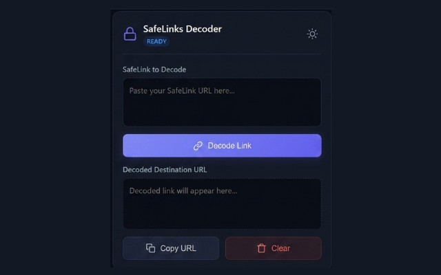
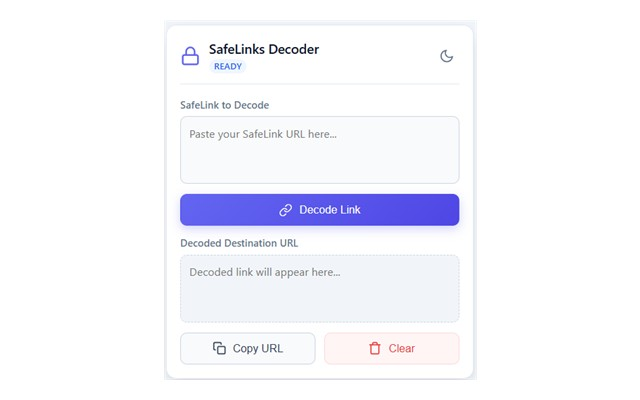

# 🛡️ SafeLinks Decoder

A lightweight, premium, and lightning-fast browser extension to decode Microsoft Defender SafeLinks and reveal the original destination URLs instantly.

---

## ✨ Features

*   🚀 **Instant Auto-Decode:** No extra clicks. Simply paste your SafeLink, and the extension decodes it in real-time.
*   🌍 **Global & Sovereign Cloud Support:** Works with standard and regional SafeLinks (`emea01`, `eur03`, `nam01` etc.) as well as Sovereign and Government Clouds (`.de`, `.cn`, `.us`, `office365.us`).
*   🎨 **Premium UI/UX:** A stunning, modern interface with glassmorphism shadows, clean vector SVG icons, and a layout optimized for long URLs.
*   🌓 **Smart Light & Dark Themes:** Elegant theme toggle with automatic preference memory.
*   📋 **One-Click Actions:** Copy the decoded URL or clear fields instantly, with visual confirmation (Toast notifications).
*   🔍 **Robust Parsing:** Extracts SafeLinks even if pasted within surrounding text, or if the `https://` protocol is missing.

---

## 📸 Screenshots

| 🌙 Dark Theme | ☀️ Light Theme |
| --- | --- |
|  |  |

---

## 🛠️ Installation

### Official Web Stores
*   [Download for Google Chrome](https://chromewebstore.google.com/detail/safelinks-decoder/oelophohfcaoddckjfdoaphaienfpbdg)
*   [Download for Mozilla Firefox](https://addons.mozilla.org/en-US/firefox/addon/safelinks-decoder/)
*   [Download for Microsoft Edge](https://microsoftedge.microsoft.com/addons/detail/safelinks-decoder/ppmfkjnflgmepjilccjladbijhkiiikf)

### Manual Installation (Developer Mode)
1.  Clone this repository or download the ZIP archive.
2.  Extract the files to a local folder.
3.  Open your browser and navigate to the extensions management page:
    *   Chrome: `chrome://extensions/`
    *   Edge: `edge://extensions/`
    *   Firefox: `about:debugging#/runtime/this-firefox`
4.  Enable **Developer mode** (top-right toggle).
5.  Click **Load unpacked** (or **Load Temporary Add-on** in Firefox) and select the folder containing `manifest.json`.

---

## ☕ Support & Donation

If this extension saves you time and makes your workflow smoother, feel free to support the project:

---

## 📄 License

This project is licensed under the MIT License. See the [LICENSE](LICENSE) file for details.
